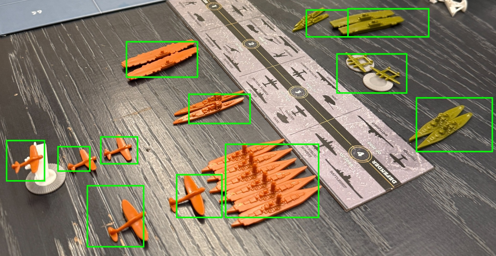
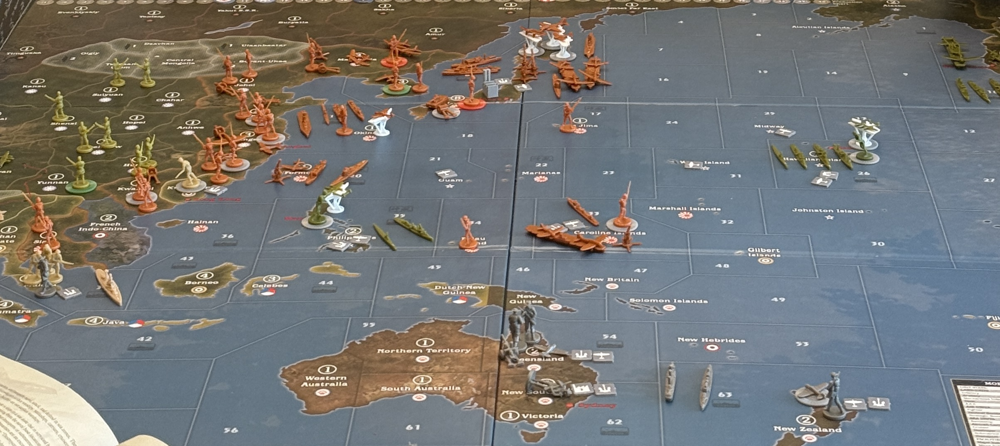

# VIT Boardgame Analyzer

A board game decision support platform for **Axis & Allies — Pacific 1940** that combines
computer vision, machine learning, and a rules-based combat simulator.

<p align="center">
  
</p>

Snap a photo of the board, and the system will:

1. **Detect & classify pieces** in the image (OWL-ViT for detection, a fine-tuned
   ViT-Small for unit classification, HSV color analysis to assign each piece to
   the **Japan** or **United States** faction).
2. **Predict the attacker's win probability** using a small MLP trained on
   simulated battles.
3. **Recommend the best attacker composition** for a given IPC (in-game currency)
   budget by sweeping unit mixes and ranking them with the same MLP.
4. **Run a single combat simulation** using a deterministic rules engine that
   models hit rolls, casualty selection, and AA fire over rounds.

<p align="center">
  
</p>

---

## Repository layout

```
app/
  backend/
    main.py              FastAPI app + combat simulator (entry point)
    pipeline.py          OWL-ViT detection, ViT classification, MLP inference
    test_pipeline.py     Standalone visualization script (matplotlib)
    requirements.txt     Python dependencies (see "Known issues" below)
    vit_classifier.pth   ViT unit-classifier weights (~87 MB, tracked in git)
    winrate_model.pt     MLP win-rate model (~1.4 MB, tracked in git)
    test/                Sample board images (t0.jpg ... test5.jpg)
  frontend/
    index.html           Static single-page UI (no build step)
    frontend_api_guide.txt   Detailed API contract reference
assets/                  Images used by this README
docs/
  readme-run-report.md   Empirical run-through of this README + known issues
```

---

## Prerequisites

- **Python 3.11 or 3.12** (3.11 is what the original venv was built with;
  3.12 is verified working on Windows. Other 3.x versions are untested.)
- **~3 GB free disk** for the HuggingFace OWL-ViT model that gets downloaded on
  first run (`google/owlvit-large-patch14`, ~1.7 GB) plus the local model files.
- **`git` on PATH** — `requirements.txt` installs one dependency
  (`PyBanner`) directly from a GitHub URL.
- **An NVIDIA GPU + CUDA toolkit** is optional but strongly recommended;
  CPU-only inference works but is slow (tens of seconds per image).

The two model files (`vit_classifier.pth`, `winrate_model.pt`) are **tracked in
git** and ship with a fresh clone — you do not need to download them separately.

---

## Setup

The steps are the same on every OS; only the venv-activation command and the
Python launcher differ.

### macOS

```bash
git clone <this-repo-url>
cd vit-boardgame-analyzer/app/backend

python3.11 -m venv venv               # or python3.12
source venv/bin/activate

python -m pip install --upgrade pip
python -m pip install -r requirements.txt

# Currently missing from requirements.txt — install manually for now:
python -m pip install transformers python-multipart
```

Apple Silicon: PyTorch will auto-detect MPS (Metal) acceleration. No extra
install is required.

### Linux

```bash
git clone <this-repo-url>
cd vit-boardgame-analyzer/app/backend

python3.11 -m venv venv               # or python3.12
source venv/bin/activate

python -m pip install --upgrade pip
python -m pip install -r requirements.txt

# Currently missing from requirements.txt — install manually for now:
python -m pip install transformers python-multipart
```

The default `torch` wheel on Linux x86_64 ships with CUDA 12.x runtime built in
and will auto-detect a compatible NVIDIA GPU.

### Windows (PowerShell)

```powershell
git clone <this-repo-url>
cd vit-boardgame-analyzer\app\backend

py -3.12 -m venv venv                 # or py -3.11 if installed
venv\Scripts\activate

python -m pip install --upgrade pip
python -m pip install -r requirements.txt

# Currently missing from requirements.txt — install manually for now:
python -m pip install transformers python-multipart
```

> **GPU note for Windows:** the default `torch` wheel from PyPI on Windows is
> **CPU-only**. To enable CUDA, after the install above run:
>
> ```powershell
> python -m pip uninstall -y torch torchvision
> python -m pip install torch torchvision --index-url https://download.pytorch.org/whl/cu124
> ```
>
> (Use the index URL matching your installed CUDA toolkit; see
> <https://pytorch.org/get-started/locally/>.)

---

## Running the app

The app has two pieces: a Python **backend** that has to be running, and a
static HTML **frontend** that you open in a browser. Use two terminals.

### 1. Start the backend

From `app/backend/` with the venv active:

```bash
python -m uvicorn main:app --host 127.0.0.1 --port 8000
```

For development with auto-reload, append `--reload`.

On the **very first run**, the FastAPI startup hook downloads the OWL-ViT
detector from HuggingFace (~1.7 GB into `~/.cache/huggingface/`). This can take
a few minutes; subsequent starts load from the local cache and finish in
seconds. While loading, you'll see `Downloading model.safetensors: NN%` lines
streaming.

When the server is ready you'll see:

```
INFO:     Started server process [12345]
All models loaded  device=cpu                   # or 'mps' / 'cuda'
INFO:     Application startup complete.
INFO:     Uvicorn running on http://127.0.0.1:8000 (Press CTRL+C to quit)
```

Stop the server with **Ctrl+C** (Windows / Linux / macOS).

### 2. Verify the backend is up

In a **second** terminal:

```bash
curl http://127.0.0.1:8000/health
# → {"status":"ok"}
```

You can also browse the auto-generated FastAPI docs at
<http://127.0.0.1:8000/docs> — every endpoint has a "Try it out" button you can
poke without touching the frontend.

### 3. Open the frontend

`app/frontend/index.html` is a static page — no build, no dev server. Just open
it in any modern browser:

- **macOS:** `open app/frontend/index.html`
- **Linux:** `xdg-open app/frontend/index.html`
- **Windows (PowerShell):** `start app\frontend\index.html`

The page expects the backend at `http://localhost:8000` (hardcoded in
`index.html`). If you change the uvicorn host/port, edit the `BASE` constant in
`<script>` near the top of `index.html`.

<p align="center">
  
</p>

---

## Using the app

A typical session always follows the same three steps:

1. **Pick a mode** — `01 Win Rate Prediction`, `02 Best Composition`, or
   `03 Combat Simulation` (top of the page).
2. **Upload a board photo** — JPG or PNG of an Axis & Allies Pacific 1940
   territory with units placed on it. The image is sent to `POST /analyze`,
   which detects pieces with OWL-ViT, classifies each one with the ViT
   classifier, and assigns it to **Japan** (orange) or **United States**
   (green) by sampling pixel hue. A modal pops up with the counts.
3. **Confirm or edit unit counts** — recognition isn't perfect; review the
   numbers in the modal and adjust any wrong ones. Switch the **Attacker** with
   the toggle (default is Japan attacking USA). Hit **Confirm** to run the
   chosen mode.

### Mode 1 — Win Rate Prediction

Sends the confirmed unit counts to `POST /winrate`. Returns a single number:
the MLP-predicted **probability that the attacker wins** this battle.

The number is shown big and color-coded:

- **Green** ≥ 60% — favorable attack.
- **Yellow** 40–60% — coin flip; reconsider.
- **Red**   < 40% — likely to lose.

It also prints the IPC totals on each side as a quick economic sanity check
(see *Understanding the output → IPC*).

### Mode 2 — Best Composition

Sends the same payload to `POST /recommend`. Backend keeps the **defender's**
units fixed and brute-force searches the space of buyable attacker mixes,
ranking each mix by the same MLP win-rate model. It returns **exactly two**
recommended compositions:

- **Card 1 — "Attacker budget (X IPC)":** the best attacker mix you could
  field for the *same IPC value* the attacker currently has on the board. Think
  of this as "what should I have brought to this fight instead?".
- **Card 2 — "Defender budget (Y IPC)":** the best attacker mix at the
  *defender's* IPC value. Useful when planning future attacks and asking "if I
  invest as much as they did, what's optimal against this stack?".

Each card shows its own predicted win rate (same color scale as Mode 1) and the
unit breakdown. The current win rate is shown above the cards for comparison.

### Mode 3 — Combat Simulation

Sends the same payload to `POST /simulate`. Runs **one** deterministic
rules-based battle through to completion and reports:

- **Winner** — `JP` or `US`.
- **Attacker survivors** — units left alive on the attacking side.
- **Defender survivors** — units left alive on the defending side.

The simulator's RNG is seeded (`numpy.random.default_rng(42)`), so given
identical inputs it always returns identical outputs. To see the variance, run
many fights yourself by sweeping the seed in `main.py` — there's no built-in
"run N times" endpoint.

---

## Understanding the output

### Unit vocabulary

The whole stack uses these eight unit types and IPC ("Industrial Production
Certificates" — the in-game currency) costs:

| Code         | Name                | IPC | Notes |
| ------------ | ------------------- | --- | ----- |
| `Infantry`   | Infantry            | 3   | Attacks at 1; with paired artillery at 2 |
| `Mech`       | Mechanized infantry | 4   | Folded into infantry pool during combat, then split back out for display |
| `Artillery`  | Artillery           | 4   | Attacks/defends at 2; boosts paired infantry |
| `Tank`       | Tank                | 6   | Attacks/defends at 3 |
| `Fighter`    | Fighter aircraft    | 10  | Attacks at 3, defends at 4 |
| `TacBmb`     | Tactical bomber     | 11  | Attacks at 3 (4 if paired with fighter or tank), defends at 3 |
| `StrBmb`     | Strategic bomber    | 12  | Attacks at 4, defends at 1 |
| `AA`         | Anti-aircraft gun   | 5   | **Defender-only**, fires once at start of combat against attacking aircraft |

(Hit probabilities above are out of 6, A&A's d6 mechanic.)

### Factions

Only two factions are modeled: **Japan (`JP`)** and **United States (`US`)**.
The image classifier assigns each detected piece to one of them by averaging
HSV hue inside the bounding box — Japan's tan/orange pieces vs. USA's green
pieces. Other-color pieces (UK, ANZAC, China, etc.) are silently dropped.

### `win_rate`

A floating-point number in `[0.0, 1.0]`. It is the MLP's predicted probability
that the **side currently selected as attacker** wins this single combat,
*given the exact unit counts on both sides*. The model was trained on
simulated battles, so it implicitly captures things like artillery pairing,
TacBmb bonuses, and AA fire — but it is a learned approximation and can be off
by single-digit percentage points. Treat it as a strategic indicator, not a
guarantee.

### IPC totals (`attacker_ipc`, `defender_ipc`)

Just the dot-product of the unit counts with the IPC table above. Useful for
answering "did I bring enough force for this fight?". The recommendation
endpoint uses these as the search budgets.

### `recommendations[*].units`

A composition the MLP scored highest within `budget` IPC. The search space
excludes `AA` because in A&A an attacker cannot bring AA — so the returned
`units` object simply omits the `AA` key (other endpoints zero-pad it; see
*Known issues*).

### `winner`, `attacker_survivors`, `defender_survivors`

Output of one run of the deterministic simulator. The `combat()` function in
`main.py` implements:

1. **AA fire** (once, at the start). Each defending AA gun rolls up to 3 shots
   (capped at the number of attacking aircraft) at 1/6 to hit. Casualties come
   off `Fighter`, then `TacBmb`, then `StrBmb`.
2. **Combat rounds** until one side is wiped:
   - Both sides roll all their hits **simultaneously** based on the
     attack/defense values above.
   - Casualties are applied to land units first, then air units, in order:
     infantry → artillery → tank → fighter → tac bomber → strategic bomber.
   - Mechanized infantry is merged into the infantry pool at the start of
     combat for casualty selection, then split back out for display only.
3. **Battle ends** when one side has no remaining land or air units. AA does
   not count toward survival (a stack of just AA is considered defeated).

`winner` is `"JP"` or `"US"` (an actual faction, not "A"/"D"). Survivor
dictionaries use the same eight unit-type keys as the input.

---

## API reference (cheat sheet)

For full request/response shapes see
[`app/frontend/frontend_api_guide.txt`](app/frontend/frontend_api_guide.txt) or
the live Swagger UI at <http://127.0.0.1:8000/docs>.

| Method | Path | Purpose |
| --- | --- | --- |
| `GET`  | `/health`    | Liveness probe. |
| `POST` | `/analyze`   | Multipart image upload → detected `JP`/`US` unit counts. |
| `POST` | `/winrate`   | JSON `{attacker, JP, US}` → `{win_rate, attacker_ipc, defender_ipc}`. |
| `POST` | `/recommend` | Same input → `{current_win_rate, recommendations: [budget1, budget2]}`. |
| `POST` | `/simulate`  | Same input → `{winner, attacker_survivors, defender_survivors}`. |

Quick smoke test without the frontend (Linux / macOS / Git Bash):

```bash
# Win rate for 3 inf + 1 art (JP) attacking 2 inf + 1 tank (US):
curl -s -X POST http://127.0.0.1:8000/winrate \
  -H 'Content-Type: application/json' \
  -d '{"attacker":"JP",
       "JP":{"Infantry":3,"Artillery":1,"Mech":0,"Tank":0,"Fighter":0,"TacBmb":0,"StrBmb":0,"AA":0},
       "US":{"Infantry":2,"Tank":1,"Mech":0,"Artillery":0,"Fighter":0,"TacBmb":0,"StrBmb":0,"AA":0}}'
```

PowerShell equivalent:

```powershell
$body = @{
  attacker = 'JP'
  JP = @{Infantry=3; Artillery=1; Mech=0; Tank=0; Fighter=0; TacBmb=0; StrBmb=0; AA=0}
  US = @{Infantry=2; Tank=1; Mech=0; Artillery=0; Fighter=0; TacBmb=0; StrBmb=0; AA=0}
} | ConvertTo-Json
Invoke-RestMethod -Uri http://127.0.0.1:8000/winrate -Method Post `
  -ContentType 'application/json' -Body $body
```

---

## Stop / clean up

```bash
deactivate
```

To free disk after experimenting:

- **HuggingFace cache:** `~/.cache/huggingface/` (Linux/macOS) or
  `%USERPROFILE%\.cache\huggingface\` (Windows).
- **Local venv:** delete `app/backend/venv/`.

---

## Known issues

The README and code currently have several rough edges. Full empirical
walkthrough (every command run, every error encountered, with reproductions) is
in [`docs/readme-run-report.md`](docs/readme-run-report.md). Highlights:

- `requirements.txt` is missing `transformers`, `python-multipart`, and
  `matplotlib` (the latter only needed for `test_pipeline.py`).
- `requirements.txt` lists `scikit-learn` but nothing in the codebase uses it.
- The `/simulate` endpoint under-counts defender mech / AA casualties in some
  cases — surviving counts may be slightly inflated.
- The `/recommend` response omits the `AA` key in returned compositions
  (other endpoints include it).
- The HEIC hint in the upload UI is not actually supported by the backend
  (Pillow has no HEIC decoder unless `pillow-heif` is installed).
- Device selection in `main.py` and `pipeline.py` is inconsistent (one prefers
  CUDA, the other only checks MPS/CPU). Force CPU with
  `CUDA_VISIBLE_DEVICES=""` if you hit a device-mismatch error.
- A stale `app/backend/venv/` (built on macOS) is committed in the repo and
  should be ignored — always create your own venv as shown above.
