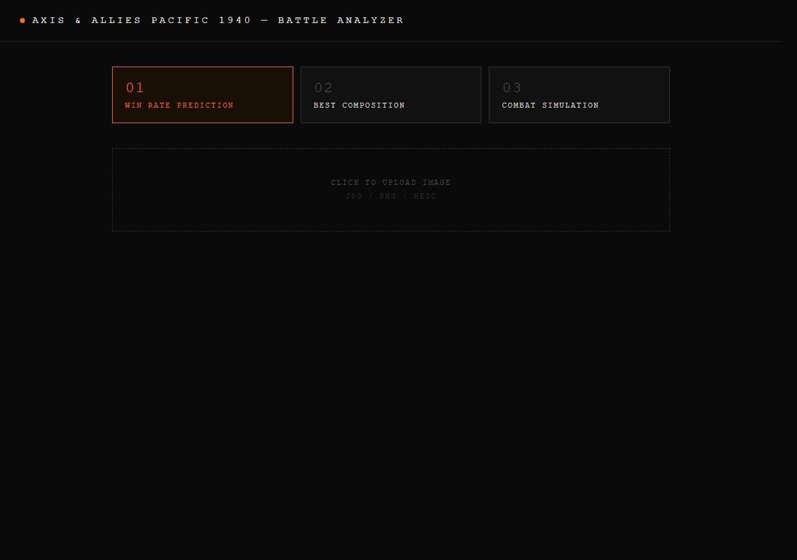
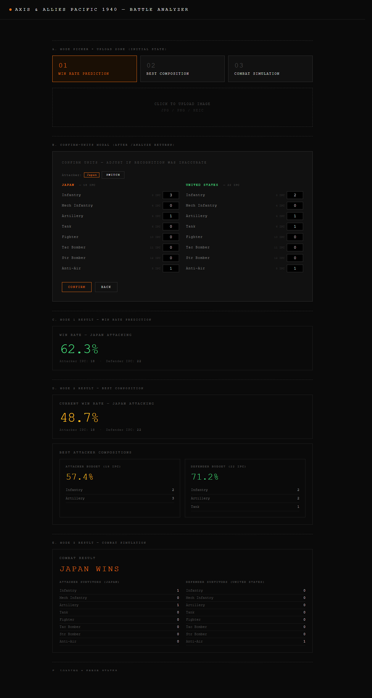

# Frontend UI Review — Axis & Allies Pacific 1940 Battle Analyzer

A walkthrough of `app/frontend/index.html` as it actually renders today, what each
on-screen element is communicating, and where the design choices either help or
hurt the user.

> Captured by rendering the page in headless Microsoft Edge against ground-truth
> HTML/CSS, plus a one-off demo page (`ui_demo.html`, since deleted) that
> pre-populated every dynamic state so all of them could be screenshotted without
> a running backend.

---

## 1. At-a-glance summary

The frontend is a **single static HTML file** (~450 lines, no build step, no
framework — just inline `<style>` and `<script>`). It talks to the FastAPI
backend on `http://localhost:8000` and exposes three analytical modes.

The visual identity is **dark, monochrome, and deliberately "tactical"**:
pure-black background, Courier New monospace, tiny uppercase labels with heavy
letter-spacing, a single orange accent (`#f97316`) plus a single green accent
(`#4ade80`) representing the two factions. The whole thing reads as a
*command-console / war-room dashboard*, not as a board-game companion app.

It is competently built, internally consistent, and far more polished than the
back-end docs — but it has notable rough edges around discoverability, error
states, and explanation of what the numbers mean.

---

## 2. What the user sees

### 2.1 Initial state



What is on the page when first loaded:

- **Header bar** — a small orange dot (status-light style) and the title
  *"AXIS & ALLIES PACIFIC 1940 — BATTLE ANALYZER"* in tracked-out caps. No
  description, no help link, no version, no GitHub link.
- **Three mode buttons** in a 1:1:1 grid:
  - `01 WIN RATE PREDICTION`
  - `02 BEST COMPOSITION`
  - `03 COMBAT SIMULATION`

  The active button is filled with a dark-orange tint and bordered in orange;
  inactive buttons are dark-grey on charcoal. The `01 / 02 / 03` numerals are
  oversized, suggesting these are sequential operations rather than parallel
  features.
- **Upload zone** — a wide dashed rectangle with the text *"CLICK TO UPLOAD
  IMAGE"* and a tiny *"jpg / png / heic"* hint underneath. Both lines are
  near-invisible (color `#555` on black). Clicking opens a file picker.
- **Below that, nothing.** No example image, no usage walkthrough, no sample
  output, no link to known issues.

### 2.2 The full set of dynamic states

The image below is a vertical mock — same CSS as the real app, but every
state is rendered at once so they can all be inspected in a single frame.



Reading top to bottom:

- **A. Mode picker + upload zone** — same as 2.1, included for context.
- **B. Confirm-units modal** — pops up the moment `/analyze` returns. Two
  side-by-side columns titled **JAPAN** (orange) and **UNITED STATES** (green),
  each with all eight unit types listed and the detected count pre-filled in a
  small numeric input. Each row also shows the per-unit IPC cost. The header
  reads *"Confirm units — adjust if recognition was inaccurate"*, making the
  intent unambiguous: this is a human-in-the-loop checkpoint, not a final
  result. The currently selected attacker (default JP) is shown as a badge with
  a `SWITCH` button. Bottom row: orange `CONFIRM` (primary), grey `BACK`
  (secondary).
- **C. Win Rate result** — one block with a header (`WIN RATE — JAPAN
  ATTACKING`), a 48-pixel colored percentage (green/yellow/red by threshold),
  and a tiny line of attacker / defender IPC totals.
- **D. Best Composition result** — two stacked blocks: the first repeats the
  current win rate, the second titled `BEST ATTACKER COMPOSITIONS` shows two
  side-by-side `rec-card`s. Each card has its own win-rate percentage and a
  small two-column unit list (only nonzero units appear). Card labels are the
  literal IPC value (`Attacker budget (18 IPC)` / `Defender budget (22 IPC)`)
  rather than friendly names like "your spend / their spend".
- **E. Combat Simulation result** — `COMBAT RESULT` header, then the winner in
  oversized faction-colored caps (`JAPAN WINS` in orange, `UNITED STATES WINS`
  in green), then two columns of survivor counts — one per side, listing **all
  eight unit types** even when the count is zero. This is the noisiest panel in
  the app.
- **F. Loading / error** (cut off in the screenshot but present in the CSS):
  - Loading: centered grey *"Computing"* with three animated dots.
  - Error: red text inside a red-tinted border — a single sentence like
    *"Connection error — is backend running on port 8000?"*.

---

## 3. Design language and what it signals

| Element                   | Choice                                              | What it signals                              |
| ------------------------- | --------------------------------------------------- | -------------------------------------------- |
| Background                | `#0a0a0a` (near black)                              | Serious, low-distraction, "operations room"  |
| Body text                 | `#e0e0e0` light grey on black                       | High contrast for data, easy on the eyes     |
| Font                      | `'Courier New', monospace`                          | Engineering / military telex aesthetic       |
| Headings                  | 10–12 px uppercase, 2–4 px letter-spacing           | Dossier / classified-document feel           |
| Numbers                   | 28–48 px, often colored                             | The number *is* the answer; everything else is chrome |
| Accent #1                 | `#f97316` orange — Japan, primary action, focus     | Faction color; A&A pieces are tan/orange     |
| Accent #2                 | `#4ade80` green — United States                     | Faction color; A&A pieces are green          |
| Win-rate semantic colors  | green ≥60%, yellow 40–60%, red <40%                 | Decision-traffic-light — instant verdict     |
| Borders                   | 1 px hairlines (`#222`–`#333`)                      | Subtle separation; "everything is a panel"   |
| Cursor blink / glow       | None                                                | Restraint — no "tactical" theatrics          |
| Layout                    | 960 px max-width centered, generous padding         | Reads like a report, not a tool palette      |

The cumulative read is **"a serious decision-support console for a serious
strategy game"**. It is *not* trying to look like a video game, a board-game
companion app, or a casual analytics dashboard. It is closer in spirit to a
Bloomberg Terminal than to BoardGameGeek. Given that Pacific 1940 is itself a
heavy, hours-long wargame, this matches the audience.

The faction colors mirror the actual plastic colors of Japan (tan/orange) and
USA (green) on the physical board — a nice cross-medium consistency that
removes one cognitive translation step.

---

## 4. Information architecture

The app has exactly **one flow**:

```
Pick mode  →  Upload image  →  Confirm units (modal)  →  See result
   │                                                          │
   └─ resets the result panel ──────────────────────────────  │
                                                              ▼
                                                 (re-uploading restarts the flow)
```

There is no navigation, no pagination, no settings, no history. Every action
the user can take is visible on screen at once. This is a strength: the flow is
impossible to misnavigate. It is also a limitation: there's no way to compare
two photos, save a result, or run a batch sweep.

The **modal interrupting the flow** is the most consequential UX decision. It
forces the user to review the CV pipeline's interpretation of the photo before
running ML on it. Without this step a misclassified piece would silently corrupt
the win-rate or recommendation. With it, the human stays in the loop and the
tool stays trustworthy. The modal is doing real work for the design.

---

## 5. What each result is *trying to portray*

### 5.1 Win Rate Prediction

> "Given this exact board configuration and this attacker, here is the model's
> probability that the attack succeeds. The economy panel is shown so you can
> sanity-check whether you brought enough force."

The single oversized colored percentage **is the answer**. The rest of the
panel exists to qualify it. The traffic-light coloring lets the user decide in
under a second whether to attack, and the IPC line lets them ask "and was that
worth my budget?".

### 5.2 Best Composition

> "Forget what you brought — given the defender, here are the two best
> attacker mixes I can find. One at the IPC value you already spent (a
> like-for-like swap), one at what the defender spent (in case you want to
> match their commitment). Compare these to your *current* win rate above to
> see how much improvement is on the table."

The two-card layout invites comparison. Putting the *current* win rate
immediately above the recommendations is what makes this mode actionable —
without it the user would have to remember the prior number from Mode 1. The
cards drop zero-count units, so the unit lists are short and scan-able.

The labels `Attacker budget (X IPC)` / `Defender budget (Y IPC)` are
information-rich but slightly cryptic — a non-A&A-native user might not
realise the second card is hypothetical ("what *would* be optimal if you
matched their spend") rather than literal.

### 5.3 Combat Simulation

> "Here is *one* outcome of this exact battle, played to completion under the
> rules of the game, with the winner and the literal pieces left on the
> table."

The oversized winner banner conveys finality. The two columns of survivors
show the cost: a Pyrrhic victory (many casualties on the winning side) is
visible at a glance.

What this panel *does not* portray, and probably should: that the result is
**deterministic** given the seeded RNG. Two clicks of the same Confirm button
will return the same simulated battle every time. A user reasonably expects a
"simulator" to be stochastic, so the absence of any "Run again" button or
mention of variance can mislead.

---

## 6. Strengths

1. **Visual coherence.** Every panel uses the same border, padding, type
   scale, and color palette. Nothing looks bolted-on.
2. **Color is doing work.** Orange/green for factions is reused in headers,
   buttons, badges, and result text. Green/yellow/red for win-rate quality is
   reused in both Mode 1 and Mode 2 cards. Users learn the legend implicitly.
3. **Human-in-the-loop confirm modal.** Forcing review of CV output before ML
   inference is a great safety net for an imperfect detector.
4. **Live IPC totals in the modal.** As soon as the user edits a count, the
   `— NN IPC` totals next to JAPAN / UNITED STATES recompute. Excellent
   feedback for users adjusting compositions.
5. **Result panel preserves the photo.** The uploaded image stays mounted in
   the upload zone above the results, so the user can keep looking at the
   board while interpreting the numbers.
6. **Mode switch is non-destructive on the upload.** Changing mode after an
   upload doesn't re-upload — it just clears the result panel. The user can
   try all three modes on the same image with one upload.

---

## 7. Friction points and gaps

The numbers are findings, not priorities. The matrix at the end suggests an
ordering.

1. **No first-use orientation.** Nothing on the page explains what the app
   does, what makes a good photo, what the modes are for, or what the
   numbers mean. A new user has to reverse-engineer the app from the labels.
2. **Mode names are uninformative until clicked.** `01 / 02 / 03` plus the
   three-word names give zero hint of what each does — there is no
   sub-caption, tooltip, or icon. "Best Composition" of *what*? "Win Rate"
   for *whom*?
3. **No legend for color semantics.** A user has to infer that orange = JP and
   green = US (only obvious if they recognize the plastic colors), and that
   green/yellow/red on a percentage means good/marginal/bad.
4. **Upload zone reads as decoration.** The dashed border + near-invisible
   `#555` text + lots of negative space makes it look like a placeholder for
   an unbuilt feature. It needs a clearer call-to-action and ideally a sample
   image preview.
5. **The "jpg / png / heic" hint is wrong.** The backend (Pillow) cannot
   decode HEIC without `pillow-heif`. iPhone users will hit a silent failure.
6. **No "type-it-in" mode.** Every analytical path requires a board photo.
   There's no way to ask "what's my win rate if I attack with 4 inf + 2 art
   into 3 inf + 1 tank" without staging the pieces and photographing them.
   Mode 2 is most useful as a planning tool, but planning usually starts from
   numbers, not a board state.
7. **Survivors panel always shows all 8 unit types.** Even if a side started
   with no aircraft and no AA, the result still lists `Fighter 0`,
   `Tac Bomber 0`, `Str Bomber 0`, `Anti-Air 0`. It's noisy and de-emphasises
   the units that actually matter.
8. **Recommendations panel hides AA without explanation.** Inverse problem:
   the `units` object on each rec-card omits the `AA` key entirely (because
   attackers can't bring AA in A&A). Users who notice the inconsistency with
   the survivors panel may suspect a bug.
9. **Mode 3 looks stochastic but isn't.** Without a "Run again" button or a
   note about the seeded RNG, users will not realize they are looking at
   *one* outcome rather than an expected outcome. There is also no way to see
   variance.
10. **`BACK` button in modal is ambiguous.** It closes the modal without
    confirming, but the inputs persist. Re-opening the flow (re-uploading)
    re-runs `/analyze` and overwrites everything. A user who tweaks numbers,
    hits Back, then re-uploads will silently lose their tweaks.
11. **Error state is a single-line generic message.** All failures collapse to
    *"Connection error — is backend running on port 8000?"*. Real errors
    (e.g. backend returning HTTP 500, model not loaded yet, image too large,
    no pieces detected) get the same treatment.
12. **`No pieces detected` warning is dropped on the floor.** The backend
    returns `{warning: "No pieces detected"}` when OWL-ViT finds nothing, but
    the frontend ignores the `warning` field and just opens the modal with
    all-zero counts. The user is left wondering whether the photo was bad or
    the board really is empty.
13. **`modal-ipc-preview` element is empty.** The HTML has a `<div
    id="ipcPreview" class="modal-ipc-preview">` and styles for it, but
    nothing ever writes into it. Suggests an unfinished design.
14. **Hardcoded backend URL.** `BASE = 'http://localhost:8000'` is baked into
    `<script>`. There is no way for a non-developer to point the page at a
    remote backend without editing source.
15. **Attacker switch has no preview.** Toggling `Attacker: JAPAN` to
    `UNITED STATES` doesn't immediately recompute or visually emphasise that
    the entire mental frame has flipped. The attacker badge updates color,
    but the columns don't.
16. **No accessibility considerations visible.** No ARIA roles, no
    keyboard-only navigation hints, low contrast on hint text (`#333` and
    `#444` on `#0a0a0a` is well below WCAG AA), no focus visibility beyond
    the default browser ring on inputs.
17. **No mobile layout consideration.** The modal is 720 px wide; the
    factions grid is two columns; long unit names can overflow on narrow
    screens. Acceptable for a desktop-only tool but worth flagging.

---

## 8. Suggested priorities (if any of this gets fixed)

| Pri | Fix                                                                                       | Why                                       |
| --- | ----------------------------------------------------------------------------------------- | ----------------------------------------- |
| P0  | Surface `analyze` `warning` field in the modal ("No pieces detected — try a clearer photo") | Prevents silent zero-count confusion      |
| P0  | Differentiate error messages (network vs. backend 500 vs. timeout)                        | Currently impossible to debug from the UI |
| P0  | Remove "heic" from the upload hint OR install `pillow-heif` and actually support it       | Setting incorrect expectations            |
| P1  | Add a sub-caption under each mode button explaining what it does                          | Cheapest possible discoverability win     |
| P1  | Add a "Run N times" or seed-rotation button to Mode 3, or label the result deterministic  | Calibrates user expectations              |
| P1  | Filter zero-count units from the survivors panel (or collapse them)                       | Reduces visual noise in Mode 3            |
| P1  | Add a "Manual entry" path that skips the upload step                                      | Unlocks planning use-cases                |
| P2  | Surface the color legend somewhere (small footer or first-load tooltip)                   | Helps non-A&A-natives                     |
| P2  | Move `BASE` URL into a `<script>` config or query-string override                         | Enables remote backends                   |
| P2  | Add basic ARIA roles + focus-visible styles                                               | Keyboard / screen-reader users            |
| P2  | Add a mobile breakpoint for the modal grid                                                | Phone-photo-on-the-spot use case          |

---

## 9. Verdict

The frontend is **the single most polished artefact in the repository**. The
visual design is consistent, the flow is short, and the human-in-the-loop
modal is genuinely smart. It looks and feels like the work of someone who
understands both the game and the audience.

What's missing is mostly **explanatory and defensive UX** — telling new users
what they are looking at, surfacing warnings the backend already provides,
distinguishing classes of error, and supporting workflows that don't start
with a photo. None of these require a redesign; they're additive and could be
done without changing the visual language at all.
